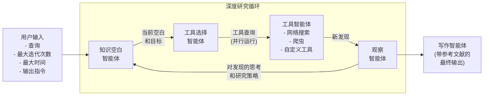
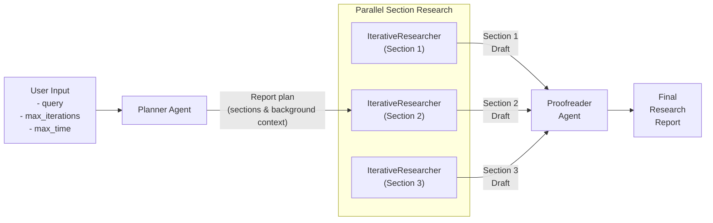

启动：uvicorn server.app:app --reload --host 0.0.0.0 --port 8000


# 使用 OpenAI Agents SDK 的智能深度研究

这是一个使用 [OpenAI Agents SDK](https://github.com/openai/openai-agents-python) 构建的强大深度研究助手，旨在对任何给定主题进行深入研究。兼容 OpenAI、Anthropic、Gemini、DeepSeek、Perplexity、OpenRouter、Hugging Face 以及 Ollama 等本地模型。

它采用多智能体架构，通过迭代方式工作，不断完善对主题的理解，产生越来越详细的见解，最终形成最终报告。

该项目设计为可扩展的，可以使用自定义工具和任何其他与 OpenAI API 规范兼容的第三方 LLM。LLM 和工具调用可以选择使用 OpenAI 的追踪功能进行追踪。

相关背景阅读请参考[这里](https://www.j2.gg/thoughts/deep-research-how-it-works)。

## 概述

该软件包有两种研究模式：

- `IterativeResearcher`（迭代研究者）：对某个主题或子主题进行持续循环研究并起草报告
  - 这是首选方案，适用于较短的报告（最多 5 页/1,000 字）
  - 用户可以指定研究深度、时间限制、报告长度和格式要求等约束条件
- `DeepResearcher`（深度研究者）：运行更全面和结构化的流程，首先形成报告大纲，然后为报告的每个部分并行运行 `IterativeResearcher` 实例
  - 这适用于较长的报告（如 20+ 页）

`DeepResearcher` 的工作流程如下：

1. 接收研究主题并进行初步研究，形成报告大纲/计划
2. 对报告计划的每个部分，并行运行 `IterativeResearcher` 实例，它会：
   1. 识别当前研究中的知识空白
   2. 战略性地选择合适的工具来填补这些空白
   3. 通过专门的智能体执行研究行动
   4. 将发现综合成一个全面的章节
3. 将所有章节编译成一份连贯且结构良好的报告

值得注意的是，深度研究智能体在开始时不会提出澄清性问题，因此可以自动化使用。

## 示例输出

深度研究示例（使用 DeepResearcher）：
- [柏拉图的生平与著作](examples/sample_output/plato.md) - 7,980 字
- [量子计算教科书](examples/sample_output/quantum_computing.md) - 5,253 字
- [特斯拉深度研究](examples/sample_output/tesla.md) - 4,732 字

简单研究示例（使用 IterativeResearcher）：
- [Quantera 市场规模](examples/sample_output/quantera_market_size.md) - 1,001 字
- [英国政府政策](examples/sample_output/labour_policies.md) - 1,077 字

## 流程图

### IterativeResearcher 流程



### DeepResearcher Flow



## Installation

Install using `pip`:

```
pip install deep-researcher
```

Or clone the GitHub repo:

```sh
git clone https://github.com/qx-labs/agents-deep-research.git
cd agents-deep-research
pip install -r requirements.txt
```

Then create a `.env` file with your API keys:

```sh
cp .env.example .env
```

Edit the `.env` file to add your OpenAI, Serper and other settings as needed, e.g.:

```sh
OPENAI_API_KEY=<your_key>
SEARCH_PROVIDER=serper  # or set to openai
SERPER_API_KEY=<your_key>
```

## Usage

### Python Module

```python
# See the /examples folder for working examples
import asyncio
from deep_researcher import IterativeResearcher, DeepResearcher

# Run the IterativeResearcher for simple queries
researcher = IterativeResearcher(max_iterations=5, max_time_minutes=5)
query = "Provide a comprehensive overview of quantum computing"
report = asyncio.run(
    researcher.run(query, output_length="5 pages")
)

# Run the DeepResearcher for more lengthy and structured reports
researcher = DeepResearcher(max_iterations=3, max_time_minutes=5)
report = asyncio.run(
    researcher.run(query)
)

print(report)
```

### Command Line

Run the research assistant from the command line.

If you've installed via `pip`:
```sh
deep-researcher --mode deep --query "Provide a comprehensive overview of quantum computing" --max-iterations 3 --max-time 10 --verbose
```

Or if you've cloned the GitHub repo:

```sh
python -m deep_researcher.main --mode deep --query "Provide a comprehensive overview of quantum computing" --max-iterations 3 --max-time 10 --verbose
```

Parameters:

- `--query`: The research topic or question (if not provided, you'll be prompted)
- `--mode`: If `deep` uses the DeepResearcher, if `simple` uses the IterativeResearcher (default: deep)
- `--max-iterations`: Maximum number of research iterations (default: 5)
- `--max-time`: Maximum time in minutes before the research loop auto-exits to produce a final output (default: 10)
- `--output-length`: Desired output length for the report (default: "5 pages")
- `--output-instructions`: Additional formatting instructions for the final report

Boolean Flags:

- `--verbose`: Prints the research progress to console
- `--tracing`: Traces the workflow on the OpenAI platform (only works for OpenAI models)

## Compatible Models

The deep researcher is designed to run any model compatible with the OpenAI API spec, and does so by adjusting the `base_url` parameter to the relevant model provider. Compatible providers include OpenAI, Anthropic, Gemini, DeepSeek, Hugging Face and OpenRouter as well as locally hosted models via Ollama and LM Studio.

However, in order for the deep researcher to be run without errors it relies on models that are highly performant at tool calling.

- If using OpenAI models, we find that the `gpt-4o-mini` is as good if not better at tool selection than `o3-mini` (which is consistent with [this leaderboard](https://gorilla.cs.berkeley.edu/leaderboard.html)). Given the speed and cost benefits we therefore advise using `gpt-4o-mini` as the model for the majority of agents in our workflow, with `o3-mini` for planning tasks and `gpt-4o` for final writing.
- If using Gemini models, note that only Gemini 2.5 Pro (currently `gemini-2.5-pro-preview-03-25`) works well. Gemini 2.0 Flash (`gemini-2.0-flash	`), despite being listed as compatible with tool calling, very frequently fails to call any tools.

## Architecture

The Deep Research Assistant is built with the following components:

### Core Components

- **IterativeResearcher**: Orchestrates the iterative research workflow on a single topic or subtopic
- **DeepResearcher**: Orchestrates a deeper and broader workflow that includes an initial report outline, calling of multiple parallel `IterativeResearch` instances, and final proofreading step
- **LLM Client**: Manages interactions with language models so that these can be swapped out as needed

### Agent System

- **Knowledge Gap Agent**: Analyzes current research state and identifies gaps in knowledge
- **Tool Selector Agent**: Determines which tools to use for addressing specific knowledge gaps
- **Tool Agents**: Specialized agents for executing specific research actions (can be extended to add custom tools):
  - Web Search Agent
  - Website Crawler Agent
- **Writer Agent**: Synthesizes research findings into coherent reports

### Research Tools

- **Web Search**: Finds relevant information from SERP queries
  - Our implementation uses [Serper](https://www.serper.dev) to run Google searches by default, which requires an API key set to the `SERPER_API_KEY` env variable.
  - You can replace this with the native web search tool from OpenAI by setting the environment variable `SEARCH_PROVIDER` to `openai`
- **Website Crawler**: Extracts detailed content from the pages of a given website

### Implementing Custom Tool Agents

Tool agents are agents specialized in carrying out specific tasks using one or more tools (e.g. web searches, fetching and interpreting data from an API, etc). To implement a custom tool agent:
* Create any tools that the agent will use in the `app/tools` folder
* Create a new tool agent that calls this tool in the `app/agents/tool_agents` folder
* Add the tool agent definition to the `TOOL_AGENTS` variable in `app/agents/tool_agents/__init__.py`
* Update the system prompt of `app/agents/tool_selector_agent.py` to include the name and description of the new agent, so that the ToolSelectorAgent knows of its existence

### Configuring Custom LLMs

This repository is in theory compatible with any LLMs that follow the OpenAI API specs. This includes the likes of DeepSeek as well as models served through OpenRouter. However, the models need to be compatible with [Structured Outputs](https://platform.openai.com/docs/guides/structured-outputs) in the OpenAI API spec (i.e. being able to set `response_format: {type: "json_schema", ...}`).

LLMs are configured and managed in the `app/llm_client.py` file 

## Trace Monitoring

The Deep Research assistant integrates with OpenAI's trace monitoring system. Each research session generates a trace ID that can be used to monitor the execution flow and agent interactions in real-time through the OpenAI platform.

## Observations and Limitations

### Rate Limits
- The `DeepResearcher` runs a lot of searches and API calls in parallel (at any given point in time it could be ingesting 50-60 different web pages). As a result you may find that yourself hitting rate limits for OpenAI, Gemini, Anthropic and other model providers particularly if you are on lower or free tiers. 
- If you run into these errors, you may wish to use the `IterativeResearcher` instead which is less consumptive of API calls.

### **Output Length:** 

LLMs are not good at following guidelines on output length. You typically run into two issues:

- LLMs are bad at counting. When giving length instructions, it's better to provide a reference that the model will be familiar with from its training data (e.g. 'length of a tweet', 'a few paragraphs', 'length of a book') rather than a specific word count. 
- Even though the output token limit on many of these models is massive, it is very difficult to get them to produce more than 1-2,000 words per response. There are methods such as [this one](https://medium.com/@techsachin/longwriter-using-llm-agent-based-pipeline-to-scale-llms-output-window-size-to-10-000-words-33210d299e2b) to produce longer outputs.

We include an `output_length` parameter for the `IterativeResearcher` to give the user control but bear in mind the above limitations.

## TODOs:

- [ ] Add unit tests for different model providers
- [ ] Add example implementation for different models
- [ ] Add compatibility with other search providers (e.g. SearXNG, Bing, Tavily, DuckDuckGo etc.)
- [ ] Add caching (e.g. Redis) of scraped web pages to avoid duplicate work/calls
- [ ] Add more specialized research tools (e.g. Wikipedia, arXiv, data analysis etc.)
- [ ] Add PDF parser
- [ ] Add integration / RAG for local files

## Author

Created by Jai Juneja at [QX Labs](https://www.qxlabs.com).