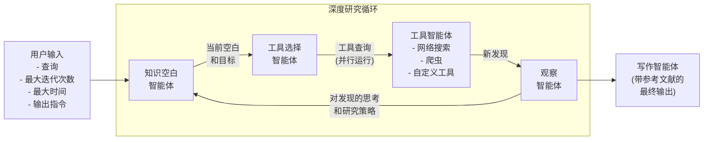
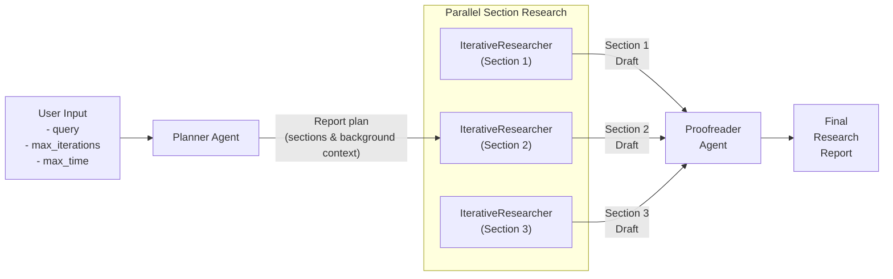

# 使用 OpenAI Agents SDK 的智能深度研究

这是一个使用 [OpenAI Agents SDK](https://github.com/openai/openai-agents-python) 构建的强大深度研究助手，旨在对任何给定主题进行深入研究。兼容 OpenAI、Anthropic、Gemini、DeepSeek、Perplexity、OpenRouter、Hugging Face 以及 Ollama 等本地模型。

它采用多智能体架构，通过迭代方式工作，不断完善对主题的理解，产生越来越详细的见解，最终形成最终报告。

该项目设计为可扩展的，可以使用自定义工具和任何其他与 OpenAI API 规范兼容的第三方 LLM。LLM 和工具调用可以选择使用 OpenAI 的追踪功能进行追踪。

相关背景阅读请参考[这里](https://www.j2.gg/thoughts/deep-research-how-it-works)。
<h5 align="left">


</h5>
原作者：https://github.com/qx-labs/agents-deep-research
我是改进，对流程的log全局输出

## 概述

该软件包有两种研究模式：

- `IterativeResearcher`（迭代研究者）：对某个主题或子主题进行持续循环研究并起草报告
  - 这是首选方案，适用于较短的报告（最多 5 页/1,000 字）
  - 用户可以指定研究深度、时间限制、报告长度和格式要求等约束条件
- `DeepResearcher`（深度研究者）：运行更全面和结构化的流程，首先形成报告大纲，然后为报告的每个部分并行运行 `IterativeResearcher` 实例
  - 这适用于较长的报告（如 20+ 页）

`DeepResearcher` 的工作流程如下：

1. 接收研究主题并进行初步研究，形成报告大纲/计划
2. 对报告计划的每个部分，并行运行 `IterativeResearcher` 实例，它会：
   1. 识别当前研究中的知识空白
   2. 战略性地选择合适的工具来填补这些空白
   3. 通过专门的智能体执行研究行动
   4. 将发现综合成一个全面的章节
3. 将所有章节编译成一份连贯且结构良好的报告

值得注意的是，深度研究智能体在开始时不会提出澄清性问题，因此可以自动化使用。

## 流程图

### IterativeResearcher 流程



### DeepResearcher Flow



## 安装
克隆 GitHub 仓库：

```sh
git clone https://github.com/techflag/deepresearch-agents.git
cd deepresearch-agents
pip install -r requirements.txt
```

然后创建一个包含你的 API 密钥的 `.env` 文件：

## Usage

### 启动
启动：uvicorn server.app:app --reload --host 0.0.0.0 --port 8000

### Python Module

```python
# See the /examples folder for working examples
import asyncio
from deep_researcher import IterativeResearcher, DeepResearcher

# Run the IterativeResearcher for simple queries
researcher = IterativeResearcher(max_iterations=5, max_time_minutes=5)
query = "Provide a comprehensive overview of quantum computing"
report = asyncio.run(
    researcher.run(query, output_length="5 pages")
)

# Run the DeepResearcher for more lengthy and structured reports
researcher = DeepResearcher(max_iterations=3, max_time_minutes=5)
report = asyncio.run(
    researcher.run(query)
)

print(report)
```

### 命令行测试

测试代码在tests目录下
```sh
python tests/test_deep_researcher.py       # 测试深度研究智能体
python tests/test_client_id.py
### 命令行使用

可以通过命令行运行研究助手。

如果你通过 `pip` 安装：
```sh
deep-researcher --mode deep --query "提供一个关于量子计算的全面综述" --max-iterations 3 --max-time 10 --verbose
```

或者如果你是克隆 GitHub 仓库后运行：

```sh
python -m deep_researcher.main --mode deep --query "提供一个关于量子计算的全面综述" --max-iterations 3 --max-time 10 --verbose--max-time 10 --verbose
```
以下是你选中部分的中文翻译：

```markdown:d:\project\deepresearch-agents\README.md
### 命令行使用

可以通过命令行运行研究助手。

如果你通过 `pip` 安装：
```sh
deep-researcher --mode deep --query "提供一个关于量子计算的全面综述" --max-iterations 3 --max-time 10 --verbose
```

或者如果你是克隆 GitHub 仓库后运行：

```sh
python -m deep_researcher.main --mode deep --query "提供一个关于量子计算的全面综述" --max-iterations 3 --max-time 10 --verbose
```

参数说明：

- `--query`：研究主题或问题（如果未提供，将提示输入）
- `--mode`：`deep` 使用 DeepResearcher，`simple` 使用 IterativeResearcher（默认：deep）
- `--max-iterations`：最大研究迭代次数（默认：5）
- `--max-time`：研究循环自动退出并生成最终输出前的最大分钟数（默认：10）
- `--output-length`：报告期望输出长度（默认："5 pages"）
- `--output-instructions`：最终报告的额外格式化指令

布尔型参数：

- `--verbose`：在控制台打印研究进度
- `--tracing`：在 OpenAI 平台追踪工作流（仅适用于 OpenAI 模型）

## 兼容模型

deep researcher 设计为可运行任何兼容 OpenAI API 规范的模型，并通过调整 `base_url` 参数适配不同模型提供商。兼容的提供商包括 OpenAI、Anthropic、Gemini、DeepSeek、Hugging Face、OpenRouter 以及本地部署的 Ollama 和 LM Studio。

但要保证 deep researcher 能正常运行，依赖于模型具备高效的工具调用能力。

- 如果使用 OpenAI 模型，我们发现 `gpt-4o-mini` 在工具选择方面与 `o3-mini` 一样优秀甚至更好（这与[该排行榜](https://gorilla.cs.berkeley.edu/leaderboard.html)一致）。考虑到速度和成本优势，建议在大多数智能体中使用 `gpt-4o-mini`，规划任务用 `o3-mini`，最终写作用 `gpt-4o`。
- 如果使用 Gemini 模型，请注意目前只有 Gemini 2.5 Pro（当前为 `gemini-2.5-pro-preview-03-25`）表现良好。Gemini 2.0 Flash（`gemini-2.0-flash`）虽然标称支持工具调用，但实际很难成功调用工具。

## 架构

Deep Research Assistant 由以下组件构建：

### 核心组件

- **IterativeResearcher**：负责单一主题或子主题的迭代研究流程
- **DeepResearcher**：负责更深层次和更广泛的流程，包括初步报告大纲、并行调用多个 `IterativeResearch` 实例，以及最终校对步骤
- **LLM Client**：管理与大模型的交互，便于模型切换

### 智能体系统

- **Knowledge Gap Agent**：分析当前研究状态并识别知识空白
- **Tool Selector Agent**：决定用哪些工具来解决特定知识空白
- **Tool Agents**：专门执行具体研究动作的智能体（可扩展自定义工具）：
  - Web Search Agent（网页搜索智能体）
  - Website Crawler Agent（网站爬虫智能体）
- **Writer Agent**：将研究发现整合成连贯报告

### 研究工具

- **Web Search**：通过 博查 查询查找相关信息
  - 默认实现使用 [博查](https://open.bochaai.com/) 进行 Google 搜索，需要在环境变量 `博查ER_API_KEY` 中设置 API key。
  - 你也可以将环境变量 `SEARCH_PROVIDER` 设置为 `openai`，以使用 OpenAI 的原生网页搜索工具
- **Website Crawler**：从指定网站页面提取详细内容

### 自定义工具智能体实现

工具智能体专门负责用一个或多个工具执行特定任务（如网页搜索、API 数据获取与解析等）。要实现自定义工具智能体：

* 在 `app/tools` 文件夹下创建所需工具
* 在 `app/agents/tool_agents` 文件夹下创建调用该工具的新工具智能体
* 在 `app/agents/tool_agents/__init__.py` 中将工具智能体定义添加到 `TOOL_AGENTS` 变量
* 更新 `app/agents/tool_selector_agent.py` 的系统提示，加入新智能体的名称和描述，以便 ToolSelectorAgent 能识别

### 自定义 LLM 配置

本仓库理论上兼容所有遵循 OpenAI API 规范的 LLM，包括 DeepSeek 及通过 OpenRouter 部署的模型。但模型需支持 [结构化输出](https://platform.openai.com/docs/guides/structured-outputs)（即能设置 `response_format: {type: "json_schema", ...}`）。

LLM 的配置和管理在 `app/llm_client.py` 文件中完成。

## 追踪监控

Deep Research Assistant 集成了 OpenAI 的追踪监控系统。每次研究会话都会生成一个 trace ID，可用于在 OpenAI 平台实时监控执行流程和智能体交互。

## 注意事项与限制

### 速率限制

- `DeepResearcher` 会并行发起大量搜索和 API 调用（任何时刻可能在处理 50-60 个网页），因此如果你使用的是 OpenAI、Gemini、Anthropic 等模型的免费或低配账号，可能会遇到速率限制。
- 如果遇到此类错误，建议使用 `IterativeResearcher`，它对 API 的消耗较低。

### **输出长度：**

LLM 在遵循输出长度指令方面表现不佳，常见两类问题：

- LLM 不擅长计数。建议用模型熟悉的参考（如“推文长度”、“几段文字”、“一本书的长度”）而非具体字数。
- 虽然许多模型的输出 token 限制很高，但实际很难让它们一次生成超过 1-2,000 字。可以参考[这篇文章](https://medium.com/@techsachin/longwriter-using-llm-agent-based-pipeline-to-scale-llms-output-window-size-to-10-000-words-33210d299e2b)实现更长输出。

我们为 `IterativeResearcher` 提供了 `output_length` 参数以便用户控制，但请注意上述限制。
```

## Author

Created by Jai Juneja at [QX Labs](https://www.qxlabs.com).
